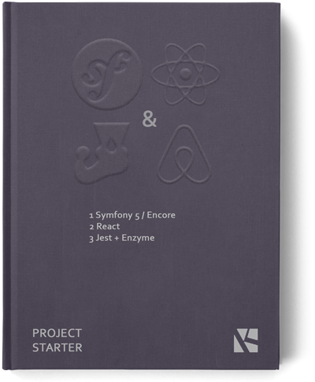
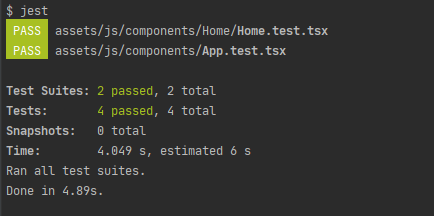
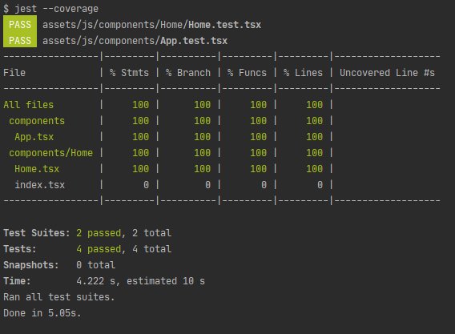

# Project Starter with Symfony 5, React, Jest + Enzyme

This simple project starter shows how to wire up Symfony 5 with React and how to test the front part of the app with Jast & Enzyme.

<div align="center">
  


</div>


## Stack
Backend of the starter is based on Symfony 5 and uses Webpack Encore shipped with the framework to integrate frontend libraries and styles.

```sh
$ symfony new symfony-react-jest-enzyme
```
### Backend dependencies
Installation of additional dependencies was required in order to embed js part of the tool inside regular Symfony/Twig template:

```
$ composer require annotations twig asset
$ composer require symfony/webpack-encore-bundle
```

### Instalation of Frontend libraries

```sh
$ yarn add react react-dom prop-types react-router-dom
$ yarn add @babel/preset-react --dev
$ yarn add @babel/plugin-syntax-jsx --dev
$ yarn add typescript ts-loader --dev
```

Typescript params were placed inside `tsconfig.json`:

```json
{
  "compilerOptions": {
    "target": "es2017",
    "module": "commonjs",
    "moduleResolution": "node",
    "jsx": "react",
    "esModuleInterop": true,
    "removeComments": true,
    "declaration": false,
    "sourceMap": true,
    "suppressImplicitAnyIndexErrors": true,
    "allowSyntheticDefaultImports": true
  },
  "strict": true,
  "compileOnSave": true,
  "exclude": [
    "node_modules"
  ]
}
```

### Overriding default Encore configuration

Webpack Encore fills in `webpack.config.js` file with initial instructions to configure the asset system.
We need to modify the file slightly, cause Jest & Enzyme require instructions from `babel.config.js` to load js modules.
To do so, remove or just comment the lines below:

Webpack Encore amendment inside `webpack.config.js`
```diff
 {
    enables @babel/preset-env polyfills
-  .configureBabelPresetEnv((config) => {
-       config.useBuiltIns = 'usage';
-       config.corejs = 3;
-    })
 }
```

External Babel configuration with `babel.config.js`

```js
module.exports = {
    presets: [
        [
            '@babel/preset-env',
            {
                targets: {
                    node: 'current',
                    browsers: [
                        "> 0.5%",
                        "last 2 versions",
                        "IE 11"
                    ]
                },
                useBuiltIns: 'usage',
                corejs : {
                    version: "3",
                    proposals : true
                }
            },
        ],
        ['@babel/preset-react'],
        ['@babel/preset-typescript']
    ],
    plugins: ["@babel/plugin-syntax-jsx"]
};
```

### Jest & Enzyme integration

```sh
$ yarn add jest enzyme enzyme-adapter-react-16 --dev
```

Jest configuration was defined inside `jest.config.js` and points to a test `setup.js` setup file:

```text
app/
├─ assets/
│ ├─ js/
│ ├─ ...
│ ├─ tests/
│     └─ setup.js
├─ jest.config.js
├─ ...
```

```js
//jest.config.js

module.exports = {
    rootDir: './assets',
    testRegex: './assets/js/.*test\\.tsx',
    setupFiles: ['<rootDir>/tests/setup.js'],
    collectCoverageFrom: [
        "<rootDir>/js/**/*.{js,jsx,ts,tsx}"
    ],
    coverageThreshold: {
        global: {
            branches: 90,
            functions: 90,
            lines: 90,
            statements: 90
        },
    }
};
```

```js
//setup.js

import React from 'react';

import { configure } from 'enzyme';
import Adapter from 'enzyme-adapter-react-16';

configure({ adapter: new Adapter() });
```
## Directory aliases

Adding aliases will help you to navigate between nested directories/components inside the project:

```diff
+ import App from '@components/App';
- //import App from './../../App';
```

- jest.config.js - define aliases for tests
- webpack.config.js - ships aliases for development

```diff
//jest.config.js

module.exports = {
    rootDir: './assets',
    testRegex: './assets/js/.*test\\.tsx',
    setupFiles: ['<rootDir>/tests/setup.js'],
+   moduleNameMapper: {
+       '^@containers(.*)$': '<rootDir>/js/containers/$1',
+       '^@components(.*)$': '<rootDir>/js/components$1',
+   },
    collectCoverageFrom: [
        "<rootDir>/js/**/*.{js,jsx,ts,tsx}"
    ],
    coverageThreshold: {
        global: {
            branches: 90,
            functions: 90,
            lines: 90,
            statements: 90
        },
    }
};
```

```diff
//webpack.config.js

...
Encore
    // directory where compiled assets will be stored
    .setOutputPath('public/build/')
    // public path used by the web server to access the output path
    .setPublicPath('/build')
    // only needed for CDN's or sub-directory deploy
    //.setManifestKeyPrefix('build/')
    .enableTypeScriptLoader()

+   .addAliases({
+       '@containers': path.resolve(__dirname, './assets/js/containers'),
+       '@components': path.resolve(__dirname, './assets/js/components')
+   })
...
```    
    
## Final directory structure

```text
app/
├─ assets/
│ ├─ js/
│ ├─ components/
│ ├─ ...
│ ├─ styles/
│ ├─ tests/
│ │   └─ setup.js
│ └─ app.tsx
│
├─ ... default Symfony directories
│
├─ templates/
│ ├─ default/
│ │   └─ index.html.twig
│ └─ base.html.twig
│ 
├─ .env
├─ package.json
├─ tsconfig.json
├─ babel.config.js
├─ jest.config.js
├─ webpack.config.js
│
└─ ... other files
```
## Tests
Project have two test files `Home.test.tsx` and `App.test.tsx` to run Jest out of the box:

```text
app/
├─ assets/
│ ├─ js/
│ ├─ components/
│ ├─  ├─ Home/
│ ├─  ├─  ├─ Home.test.tsx
│ ├─  ├─  ├─ Home.tsx
│ ├─  ├─  └─ index.tsx
│ ├─  ├─ App.test.tsx
│ ├─  └─ App.tsx
...
```

```sh
$ yarn test
```


```sh
$ yarn test --coverage
```


## Usage

Create local repository and clone the code:

```sh
$ git clone https://github.com/KamilKubicki/symfony-react-jest-enzyme.git
```

Install dependencies:

```sh
$ composer install
$ yarn
```

Run the app:

```sh
$ symfony server:start
$ yarn encore dev --watch
```

Navigating to https://localhost:8000 you should see the app main page.

